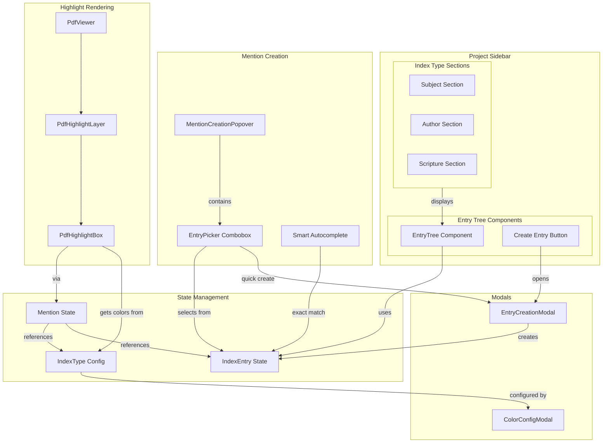

# Task 4D Implementation Plan: IndexEntry Connection UI

## Overview

Task 4D adds IndexEntry management and color configuration to connect mentions with a structured index hierarchy. This breaks down into 6 focused subtasks that can be implemented incrementally.

## Key Findings from Codebase Exploration

### Task 4C Status: ALREADY COMPLETE ✅
Multi-type diagonal stripes are already implemented in `PdfHighlightBox`:
- Uses CSS `repeating-linear-gradient(45deg, ...)` for multi-type highlights
- Colors hardcoded in `INDEX_TYPE_COLORS` constant
- Task 4D will make colors configurable

### Current Architecture
- **Mention Creation:** Uses `Combobox` from yabasic with local state (not TanStack Form)
- **Form Pattern:** `FormInput` wraps TanStack Form fields, integrates with yabasic Field components
- **Modal Component:** Available at `@pubint/yaboujee` for dialogs
- **Sidebar:** Project sidebar has placeholder content components ready for IndexEntry trees
- **Highlight Colors:** Flow from `mention.indexTypes` → `highlight.metadata.indexTypes` → `PdfHighlightBox`

## Architecture Diagram



## Subtasks Breakdown

### Task 4D-1: Types and Mock Data (30 min)
**Goal:** Define IndexEntry and IndexType types, create mock data

- Define `IndexEntry` type with `indexType` field
- Define `IndexType` type with color configuration
- Create mock IndexEntry data for testing (with hierarchy)
- Create mock IndexType configurations
- Add to editor mock data

**Files:**
- `apps/index-pdf-frontend/src/app/projects/[projectDir]/editor/_types/index-entry.ts` (new)
- `apps/index-pdf-frontend/src/app/projects/[projectDir]/editor/_types/index-type.ts` (new)
- `apps/index-pdf-frontend/src/app/projects/[projectDir]/editor/editor.tsx` (update mock data)

---

### Task 4D-2: Entry Creation Modal (2 hours)
**Goal:** Build modal form for creating IndexEntries with hierarchy

- Create `EntryCreationModal` component
- Use TanStack Form for all fields (label, aliases)
- Parent selection dropdown (filtered to current index type)
- Validation: unique label within index type
- Use `FormInput` for consistency
- Generate UUID for new entries

**Pattern:**
```tsx
<Modal open={open} onClose={onClose} title="Create Index Entry">
  <form.Field name="label">
    {(field) => <FormInput field={field} label="Label" />}
  </form.Field>
  <form.Field name="parentId">
    {(field) => <ParentSelector field={field} entries={entries} />}
  </form.Field>
  <form.Field name="aliases">
    {(field) => <FormInput field={field} label="Aliases" />}
  </form.Field>
</Modal>
```

**Files:**
- `apps/index-pdf-frontend/src/app/projects/[projectDir]/editor/_components/entry-creation-modal/entry-creation-modal.tsx` (new)
- `apps/index-pdf-frontend/src/app/projects/[projectDir]/editor/_components/entry-creation-modal/index.ts` (new)

**Tests:**
- Interactive test: Fill form, validate, create entry
- VRT: Empty state, filled state, error state

---

### Task 4D-3: Entry Picker Component (2 hours)
**Goal:** Searchable entry picker with hierarchy display and mention counts

- Create `EntryPicker` component (wrapper around `Combobox`)
- Filter entries by current index type
- Display parent-child hierarchy (indent children)
- Show mention count per entry
- "Create new entry" option when no match
- Search/filter by label

**Pattern:**
```tsx
<Combobox
  items={filteredEntries.map(e => e.id)}
  value={selectedId}
  onValueChange={onSelect}
>
  <ComboboxInput placeholder="Search entries..." />
  <ComboboxContent>
    <ComboboxEmpty>
      {inputValue ? `Create "${inputValue}"` : "Type to search"}
    </ComboboxEmpty>
    <ComboboxList>
      {(id) => {
        const entry = entries.find(e => e.id === id);
        return (
          <ComboboxItem value={id}>
            <EntryLabel entry={entry} mentions={mentions} />
          </ComboboxItem>
        );
      }}
    </ComboboxList>
  </ComboboxContent>
</Combobox>
```

**Files:**
- `apps/index-pdf-frontend/src/app/projects/[projectDir]/editor/_components/entry-picker/entry-picker.tsx` (new)
- `apps/index-pdf-frontend/src/app/projects/[projectDir]/editor/_components/entry-picker/index.ts` (new)
- `apps/index-pdf-frontend/src/app/projects/[projectDir]/editor/_components/entry-picker/components/entry-label.tsx` (new)

**Tests:**
- Interactive test: Search, select, create new
- VRT: Empty, populated, with hierarchy

---

### Task 4D-4: Project Sidebar Entry Tree (3 hours)
**Goal:** Display IndexEntry hierarchy in project sidebar sections

- Create `EntryTree` component (recursive rendering)
- Display hierarchy with visual indentation
- Show mention count per entry
- Collapse/expand parent entries
- "Create Entry" button per section
- Update placeholder content components:
  - `ProjectSubjectContent`
  - `ProjectAuthorContent`
  - `ProjectScriptureContent`

**Pattern:**
```tsx
const EntryTree = ({ entries, parentId = null, depth = 0 }) => {
  const children = entries.filter(e => e.parentId === parentId);
  
  return children.map(entry => (
    <div key={entry.id}>
      <EntryItem entry={entry} depth={depth} />
      <EntryTree entries={entries} parentId={entry.id} depth={depth + 1} />
    </div>
  ));
};
```

**Files:**
- `apps/index-pdf-frontend/src/app/projects/[projectDir]/editor/_components/entry-tree/entry-tree.tsx` (new)
- `apps/index-pdf-frontend/src/app/projects/[projectDir]/editor/_components/entry-tree/components/entry-item.tsx` (new)
- `apps/index-pdf-frontend/src/app/projects/[projectDir]/editor/_components/project-sidebar/components/project-subject-content/project-subject-content.tsx` (update)
- `apps/index-pdf-frontend/src/app/projects/[projectDir]/editor/_components/project-sidebar/components/project-author-content/project-author-content.tsx` (update)
- `apps/index-pdf-frontend/src/app/projects/[projectDir]/editor/_components/project-sidebar/components/project-scripture-content/project-scripture-content.tsx` (update)

**Tests:**
- Interactive test: Expand/collapse, create entry
- VRT: Empty, flat list, nested hierarchy

---

### Task 4D-5: Index Type Color Configuration (1.5 hours)
**Goal:** Make highlight colors configurable per index type

- Create `ColorConfigModal` component
- Allow editing index type colors
- Default color assignment logic (yellow, blue, green, red + generated)
- Update `PdfHighlightBox` to use dynamic colors
- Pass colors via `highlight.metadata.colors` array

**Color Assignment Logic:**
```tsx
const DEFAULT_COLORS = ['#FCD34D', '#93C5FD', '#86EFAC', '#FCA5A5'];

const assignDefaultColor = (ordinal: number): string => {
  if (ordinal < DEFAULT_COLORS.length) {
    return DEFAULT_COLORS[ordinal];
  }
  const hue = (ordinal * 137) % 360; // Golden angle
  return `hsl(${hue}, 70%, 50%)`;
};
```

**Files:**
- `apps/index-pdf-frontend/src/app/projects/[projectDir]/editor/_components/color-config-modal/color-config-modal.tsx` (new)
- `packages/yaboujee/src/components/pdf-highlight-layer/components/pdf-highlight-box/pdf-highlight-box.tsx` (update)
- `apps/index-pdf-frontend/src/app/projects/[projectDir]/editor/editor.tsx` (pass colors to highlights)

**Tests:**
- Interactive test: Change colors, see highlights update
- VRT: Color picker, default colors, custom colors

---

### Task 4D-6: Smart Autocomplete Integration (2 hours)
**Goal:** Auto-populate entry field on exact matches, integrate entry creation

- Replace current entry selection in `MentionCreationPopover` with `EntryPicker`
- Implement exact-match autocomplete logic
- Integrate `EntryCreationModal` for quick create
- Pass index type context to filter entries
- Update mention creation flow

**Exact Match Logic:**
```tsx
const checkExactMatch = ({ text, entries }) => {
  const normalized = text.trim().toLowerCase();
  
  return entries.find(entry => {
    if (entry.label.toLowerCase() === normalized) return true;
    
    const aliases = entry.metadata?.aliases || [];
    return aliases.some(alias => alias.toLowerCase() === normalized);
  }) || null;
};
```

**Files:**
- `apps/index-pdf-frontend/src/app/projects/[projectDir]/editor/_components/mention-creation-popover/mention-creation-popover.tsx` (update)

**Tests:**
- Interactive test: Exact match auto-populates, create new entry, attach mention
- VRT: Auto-populated state, no match state

---

## Implementation Order

1. **4D-1** → Types and mock data (foundation)
2. **4D-2** → Entry creation modal (standalone component)
3. **4D-3** → Entry picker (standalone component)
4. **4D-5** → Color configuration (updates existing highlight rendering)
5. **4D-4** → Project sidebar entry tree (uses 4D-2, 4D-3)
6. **4D-6** → Smart autocomplete integration (brings it all together)

## Testing Strategy

Each subtask includes:
- **Interactive tests** for user flows
- **Visual regression tests** for UI states
- Use existing test patterns from `MentionCreationPopover`

## Key Design Decisions

1. **Separate entries per index type** - No shared entries across types
2. **Colors from index types** - Not from individual entries
3. **Exact-match-only autocomplete** - No partial matches
4. **Two creation locations** - Sidebar (primary) and mention flow (quick)
5. **Task 4C already done** - Diagonal stripes implemented, just need configurable colors

## Success Criteria

After completing all subtasks:
- ✅ Users can create IndexEntries with hierarchy in project sidebar
- ✅ Users can browse/search entries in mention creation flow
- ✅ Highlights colored by configurable index type colors
- ✅ Multi-type highlights show diagonal stripes with correct colors
- ✅ Smart autocomplete auto-populates on exact matches
- ✅ Entry creation integrated in both locations

## Next Steps

After Phase 4 completion, Phase 5 will add backend integration:
- EdgeDB schema for IndexType and IndexEntry tables
- tRPC endpoints for CRUD operations
- Database persistence
- See `docs/development/01-pdf-viewer-annotation/phase-5-schema-changes.md`
